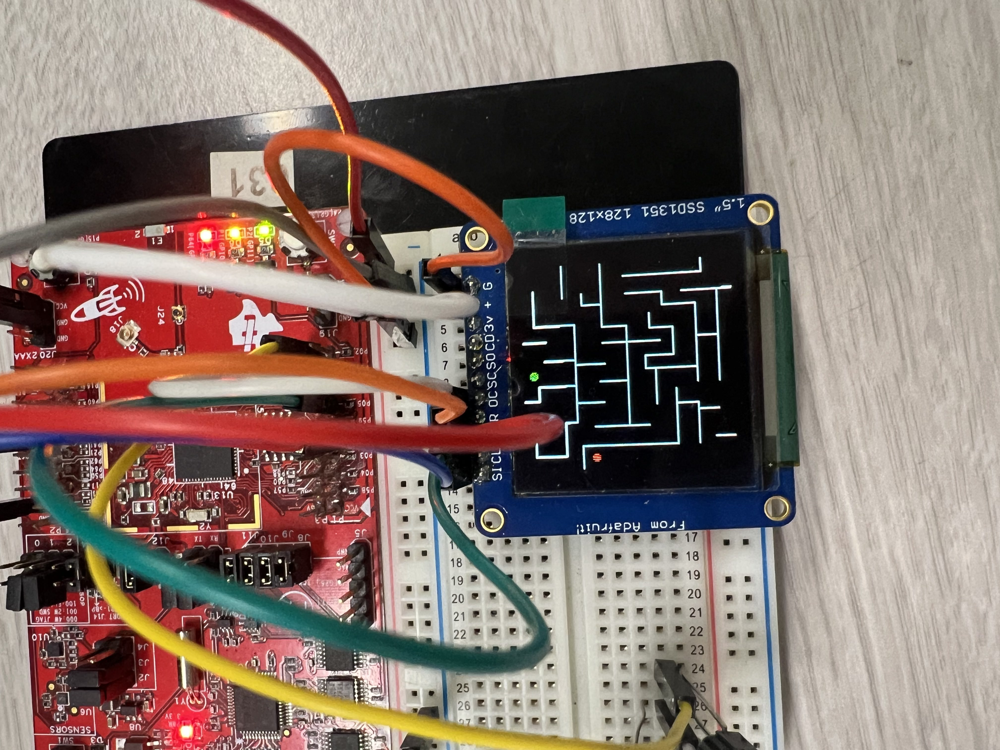
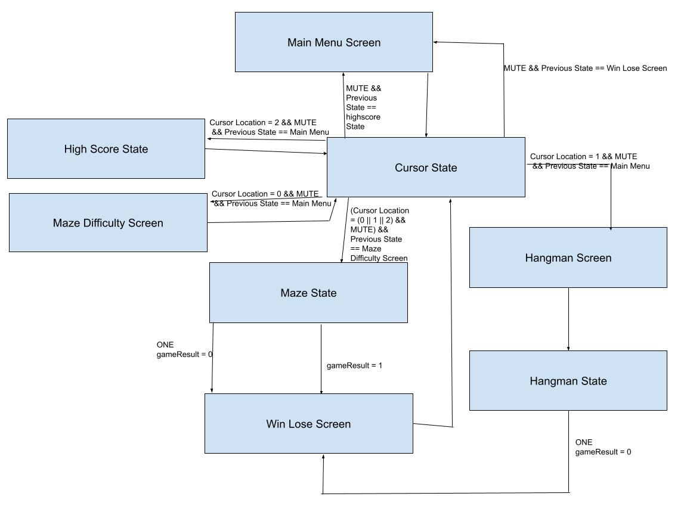

# A Game Bundle: Two Game Package

**Daniel Ledesma and Eitan Sahnovich**

*EEC172 SQ24*

## Description

The game bundle is a device that contains two pre-loaded games and a menu interface. The CC3200 is used as the general processor of this device to interpret the multiple forms of inputs from the user. AWS IoT was used to create a device shadow to store the high scores. The menu is interfaced using an IR remote to make decisions across the various menu screens. Pressing two is used to move the cursor up with five to move the cursor down. Pressing mute is the equivalent of an enter key and is used to make the decision once the cursor was properly navigated. The maze game if selected will give the open to choose an easy, medium, or hard maze. After the user has selected their difficulty the maze is loaded and the user can attempt to navigate the maze by tilting the board in the appropriate direction. The score is determined by subtracting the number of collisions from 800. If the user reaches the end zone they receive a win screen with their score. If this is a highscore then the shadow is updated with this score. The user loses if the amount of collisions surpasses 800 and is given a losing screen. The user is then navigated back to the menu screen. If navigating to the high score screen then the user will be shown the high score for each game. If navigating to the hangman game, the hangman game is loaded with the choice of 5 different words labeled as numbers for the user to guess in the game. The max word is 5 letters. The score is determined by counting the length of the word and assigning a max score for the longest word of 5 letters at 800 and 100 points less for each letter shorter than 5. If the stickman is drawn then the user loses with a score of 0 and is shown the lose screen. If the user wins they are shown the win screen with their score and if it is a highscore, the shadow is updated.

Our source code can be found [here](https://github.com/dledesma2000/GameBundle_EEC172Final.git).

## Game Screens

*Main Menu*

*Maze Difficulty*

*Easy Maze*

*Medium Maze*

*Hard Maze*

*Win/Lose Screen*

*Hangman*

## Video Demo

## Table of Contents

- [Similar Products](#similar-products)
- [Design](#design)
  - [System Architecture](#system-architecture)
  - [Functional Specification](#functional-specification)
- [Challenges](#challenges)
- [Future Work](#future-work)
- [Finalized BOM](#finalized-bom)

## Similar Products

### [VCS All-In Bundle](https://atari.com/products/atari-vcs-onyx-all-in)

- 100 Atari Games preloaded
- Controlled by controller or joystick

### [Sega Genesis Classic Game Console](https://www.amazon.com/Sega-Genesis-Classic-Game-Console-Gear/dp/B06XWBY3YP)

- 81 classic Sega games preloaded
- Controlled by controllers

## Design

### System Architecture

*Hardware Diagram*

*Game Schematic*

The CC3200 serves as the main controller for the implementation of this code. There are two sensors involved in this implementation: the accelerometer and the IR circuit. The accelerometer is communicated with using the I2C protocol. The IR circuit communicates with the NEC protocol, and the OLED is communicated with using the SPI protocol. The accelerometer is used in the maze game. The output from the accelerometer is then fed into the CC3200 to determine the orientation of the board and the new location of the next pixel.

The IR Circuit is the second sensor to detect input from the user’s IR remote. This circuit will receive the IR wave and cause an interrupt in the CC3200 to allow for the data stream to be captured by the CC3200. Depending on the state and the data stream, the CC3200 then decides the outcome of the current state or game. The CC3200 then uses the information of the current state and the input from the IR or the accelerometer to then update the OLED with the current state information. AWS is used upon initialization to get the high scores and is also called whenever there is a new high score or the high score screen is selected.

### Functional Specification

*State Diagram*

The device has the states main_menu, maze_difficulty_screen, highscore_state, maze_state, hangman_screen, hangman_state, win_lose_screen, and cursor_state. Upon loading the game, the main_menu state is the beginning state. In this state, the menu screen is printed and the cursor variables are initialized. Then the state switches to the cursor state. This state will update the cursor location and switch the states depending on the input from the IR remote. If the maze selection is made on the first menu screen, then the state switches to maze_difficulty_screen. This state will display the selection screen and update the cursor variables, then switch to the cursor state. This state will update the cursor location and switch the states depending on the input from the IR remote.

From this state, once the difficulty is selected, the state switches to maze_state. In this state, depending on the difficulty selected, the appropriate maze is created and loaded into the maze game. The device will stay in this state until the user has navigated to the end location of the map or has pressed 1 on the IR remote. Reaching the end point will load the winning screen. Pressing 1 will quit the game in a loss and load the losing screen. Both of these screens are in the win_lose_state and once they are printed, then the device enters the cursor state and waits for the user's input. Once the user presses mute, the screen is exited and the main screen is loaded again, beginning the process.

If from the main menu screen the high score screen is selected, then the state will switch to highscore_state and use AWS to grab the high score and display it along with the headers. After this is displayed, it then enters the cursor state and waits for the user's input. Once the user clicks mute, then the state switches to the main menu state and begins

## Challenges

### Menu Selection

The biggest issue encountered in this section was an efficient way to display our selection screens without having to either redraw the screens with new cursor position or delete the previously drawn screen with only our current cursor position. This was implemented with the creation of a cursor state and change cursor function. The cursor state calls a function called blinkcursor that will use the current cursor location to access an array with the appropriate screen cursor location. The change cursor function takes the appropriate array for the current screen and increments/decrements or resets the current cursor location variable and then uses this update to update the cursor variables. So in general while there is no interrupt from the remote the screen will print and immediately move into the cursor state. In the cursor state it will blink the cursor at the current location. If there is an interrupt from the remote the input is evaluated and depending on the input from the remote it will either change screens or call the change cursor function to move the cursor up or down so when blinkcursor is called again the cursor is in the new location.

There is also an issue that occurred during the recording of our demonstration. The issue being the cursor moving in a cyclic pattern across the current menu selection screen whenever attempting to video the project. The first step in investigation to come to the conclusion it must come from the phone was clicking non-recognised inputs such as the number 8 on the IR remote. As expected this input had no effect on the selection screens. Following this, holding the phone next to the IR circuit and pressing the power button on the Iphone caused the cursor to consistently move down to the next position.  Upon further research the Iphone has a proximity sensor that is always active that is [for features such as the raise-to-wake feature](https://www.moropo.com/post/list-of-all-sensors-available-in-iphone-15#:~:text=Proximity%20Sensors,visibility%20in%20any%20lighting%20condition). This proximity sensor utilizes IR to measure proximity and it seems this interferes with the IR circuit as it is being interpreted as an input. There is currently no fix for the problem but the problem was deduced.

### Maze Movement

Another Issue encountered during the development of the maze was crafting a collision system. The original collision system implemented, checked if the new location was at a banned location in the maze. A banned location is a location outside the range of the screen or where a maze wall exists. This allowed for the ball to phase through walls. The next implementation checked the 8 positions around the ball and determined banned positions then if the shifted position was one of these positions it would remain at the current location. This would still allow for the ball the phase through walls. The next attempt was to attempt to determine the respect of the ball with the walls around it and place x’s around every location outside the walls so the ball could not move to that position. Then we would update the position then clear all the added x’s. This implementation was never able to work as the x’s were unreliably placed. The final implementation checks every location of the ball that a pixel exists at and makes sure the location of every pixel did not contain an x which indicates a maze or was out of bounds. This was able to prevent the ball from passing through walls in most cases but in tight places or corners it may still occur.

### AWS Connection

When attempting to utilize the given functions for connecting to the internet, errors would occur due to wrong pin connections. In our pin configuration Pin 2 was used for the data line in the I2C communication but in the given functions, pin 2 was used for an LED during the initialization process. This was fixed by locating the macros for the LEDs in “gpio_if.h” and changing the macro from pin 2 to pin 64. This change allowed for communication between AWS and the board.

## Future Work

### Save State Implementation

For further improvements to the device, a save state of the current state and relevant variables would be implemented. The relevant variables required would be to save the current x and y location of the ball, the current maze array, and the current score. AWS would be used to save the state of all these variables using http_post and passing in the variables into the JSON message. Then once saving is done the states then navigate back to the main menu. Then when choosing the maze game it will ask to load the save or play a new game. Loading the game will call http_get() to get the JSON message, This message will then be parsed to obtain the relevant variables and then passing these variables into the mazeGame function. The input that would be mapped to this would be the digit 3 on the remote to keep all the inputs in a similar location on the remote.
 
### Random Maze Generation

Another improvement made could be from implementing random maze generation for random mazes. The first step would be to implement another cursor location on the maze difficulty selection screen for “Random.” The next step would be to generate an array with a random maze to be passed into the game function. This would be done using an algorithm to generate minimum spanning trees. Some popular algorithms are Kruskals, Prim’s, and Aldous-Broder. With further research to select the best algorithm this could be used to generate a random maze for the user to navigate.

### Random Word Selection in Hangman

One final improvement (aside from finishing hangman), would come from the implementation of a random word selection for solo play in hangman. This would be done by adding another selection for hangman rather than directly loading the game when selected. If the random word selection was made then an API would be used to query a database for a random word to be used in hangman. API ninja has a random word generator that can be interfaced with. This would most likely be used to generate a random word for the user.
  

## Finalized BOM

| No. | PART NAME                           | DESCRIPTION                                           | Qty | SUPPLIER / MANUFACTURER | UNIT COST | TOTAL PART COST | Purpose                                  |
|-----|-------------------------------------|-------------------------------------------------------|-----|--------------------------|------------|-----------------|------------------------------------------|
| 1   | CC3200-LAUNCHXL                     | MCU Board                                             | 1   | University of California, Davis | $66.00     | $66.00          | Interpret inputs from the IR circuit, read and interpret information from the onboard accelerometer and to send output to the OLED |
| 2   | Adafruit OLED SSD1351 Display       | 128x128 RGB Display, SPI Protocol                    | 1   | University of California, Davis | $39.95     | $39.95          | Display the state of the game            |
| 3   | AT&T S10-S3 General Remote          | General-purpose TV remote. IR NEC protocol           | 1   | University of California, Davis | $9.99      | $9.99           | Take user input                         |
| 4   | Vishay TSOP381xx/383xx/385xx IR Receiver | 30-56kHz Carrier Frequency depending on model    | 1   | University of California, Davis | $1.41      | $1.41           | Receive input from the IR remote        |
| 5   | 100Ω resistor                       | 0.5 W, 5% tolerance                                   | 1   | University of California, Davis | $0.57      | $0.57           | Limit current for the IR receiver        |
| 6   | 100μF capacitor                     | 16V Electrolytic Capacitor                            | 1   | University of California, Davis | $0.50      | $0.50           | DC filtering for the IR circuit        |

